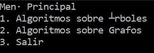

# Proyecto 2 EDD I
## Manual de usuario
### Carlos Alberto Fortín Larios 11911015
### Guillermo Andre Espinal Sierra 11851132
### Delia Melissa Rivera Ramos 21351013

## Índice

1. Introducción
2. TDA's
    - Árbol
    - Grafo
3. Menú principal
    - Menú TDA Árbol
        - Opciones del árbol
    - Menú TDA Grafo
        - Opciones del grafo

# Introducción
Este proyecto fue desarrollado para poder trabajar con los tipos de datos abstractos
árbol y grafo. Usted podrá ver la implementación de estos tipos de datos en opciones que van desde leer un árbol de un archivo hasta usar los algoritmos de Prim, Kruskal y Floyd.

# TDA's
## Árbol
Un árbol es una colección de elementos llamados nodos, uno de los cuales se distingue como raiz, que impone una estructura jerárquica sobre los nodos.

## Grafo
Un grafo es un conjunto de vértices y un conjunto de aristas, las cuales unen los vértices entre ellos. Los grafos pueden ser:
    
- Por aristas:
    - Dirigidos
    - No dirigidos
- Por el contenido de la arista:
    - Con peso o etiqueta
    - Sin peso

# Menú Principal

Menú Principal

## Opción 1: Algoritmos sobre árboles
Al seleccionar la primera opción el programa nos mostrará el menú del TDA árbol.

Una vez en este menú podemos elegir cualquiera de las opciones del TDA árbol.

1. Leer árbol de un archivo

    Se le pedirá al usuario que ingrese el nombre del achivo en el que está guardado un árbol para poder cargarlo al programa. Se le notificará al usuario si se tuvo éxito abriendo el archivo o no.

2. Imprimir recorrido preorder

    Se imprimirá el árbol cargado en orden previo. Si no hay un árbol cargado se le notificará al usuario que debe cargar uno para poder imprimirlo.

3. Imprimir recorrido in order

    Se imprimirá el árbol cargado en orden simétrico. Si no hay un árbol cargado se le notificará al usuario que debe cargar uno para poder imprimirlo.

4. Imprimir recorrido postorder

    Se imprimirá el árbol cargado en orden posterior. Si no hay un árbol cargado se le notificará al usuario que debe cargar uno para poder imprimirlo.

5. Codificador de Huffman

    Se le pedirá al usuario el nombre de un archivo de texto, para cuyo contenido se creará un código de Huffman, lo guardará en un archivo al igual que el árbol y se mostrará en pantalla. Se le notificará al usuario si se tuvo éxito abriendo el archivo o no.

6. Decodificador de Huffman

    Se le pedirá al usuario el nombre de un archivo de texto codificado y el árbol y mostrará el texto original. Se le notificará al usuario si se tuvo éxito abriendo el archivo o no.

7. Regresar al Menú Principal 

    Se regresa al menú principal.

## Opcion 2: Algoritmos sobre grafos

Al seleccionar la segunda opción el programa nos mostrará el menú del TDA grafo.

Una vez en este menú podemos elegir cualquiera de las opciones del TDA grafo.

1. Leer grafo de un archivo

    Se le pide al usuario el nombre de un archivo de texto a partir del cual se leerá el Grafo. Antes leer el grafo se debe preguntar si se lee a una matriz o a una lista. Se le notificará al usuario si se tuvo éxito abriendo el archivo o no.

2. Prim

    Imprime el resultado del algoritmo de Prim.

3. Kruskal

    Imprime el resultado del algoritmo de Kruskal.

4. Floyd

    Imprime el resultado del algoritmo de Floyd.

5. Regresar al Menú principal 

    Se regresa al menú principal.

## Opción 3: Salir

Se sale del programa.